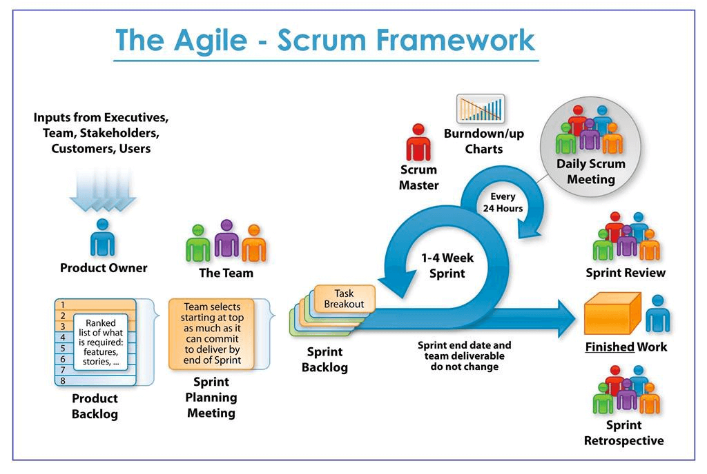

在国内，某些大厂的技术面被戏称为「面试造火箭，入职拧螺丝」。  
面试前都要充分准备（刷题），尤其是很多日常几乎碰不到的问题。  
例如对前端开发来说，老生常谈的有浏览器渲染过程，JS 原型链等。

然而在以应用层面为主的澳洲，技术面试几乎不涉及底层原理与实现。  
除面 Canva 之外，我遇到最难的问题竟然是 JavaScript 的 call / apply。

当然，也有例外的：

* 纯算法类  
  建议提前刷 HackerRank / LeetCode 练手。
* 出其不意  
  例如，知名独角兽 Canva 可能会让实现 Virtual DOM。
* 校园招聘（Graduate Program）  
  部分竞争激烈的校招，难度往往会很高（e.g. PR required）。
* ...*（TODO：请同行们继续补充）*

## 类型

通常，技术面试会延续之前的做题：  
若之前是算法主导，那么技术面也会继续考底层，前后几乎没有关联；  
若之前是项目主导，那么技术面基本就是该项目的拓展，关联度很高。

## 理解敏捷开发（Agile）

> 有关 Agile 的概念，不妨参考阮一峰的 [敏捷开发入门教程](https://www.ruanyifeng.com/blog/2019/03/agile-development.html)。

国内大厂讲求实用性，快准狠，很少听到偏理论化的指导思想。  
在澳洲的大厂，通常都会采用「敏捷开发」来指导开发流程。  
不过这个「采用」可以是有程度的，并不一定要完全履行。

**Agile 通过快速迭代、持续交付，以确保所开发的都是有价值的需求**：

1. 采用较短的开发周期，小步快跑
2. 及早交付给用户，争取得到及早反馈
3. 根据用户反馈，及时调整，灵活把握方向

作为普通开发，只需要了解就够了，毕竟不是专业的 Agile Master。  
但对于像我这种过去没有在 Agile 环境待过的同学来说，还是应该多做点功课。  
尤其是在面试的时候，对方可能会问及相关的话题，有些概念最好先提前理解好。

### Scrum

> 有关 Scrum 的概念，不妨参考 [敏捷开发之 Scrum 扫盲篇](https://www.cnblogs.com/taven/archive/2010/10/17/1853386.html)。  

Agile 只是理论层面的方法论，要落实还得有一套执行模式。  
例如，比较常见的是 Scrum + Kanban，这也是很多大厂的套路。  
（以下例图来自 [Agile and Scrum Overview](https://medium.com/jorgeacetozi/agile-and-scrum-overview-fb68fc04aff8)）

概念性的东西太多了，下面以我新入职的团队为例进行说明。

目前我们组采取 Scrum 模式，一个 Sprint 的周期为两周。  
开始前有 Planning meeting，结束时有 Review & Retrospective meeting。  
每天早上都有 15 min 的 Stand-up meeting，供每人汇报昨日进度及今日计划等。  
所有的这些都基于 Atlassian Jira 项目管理系统，该提供看板（Kanban）便于进度管理。

我作为开发，基本上就是等 boss 在 Jira 给我指派 ticket（类似于 Github 的 issue）。  
如果即将做或已经开始做了，那么我就会在 Stand-up meeting 时就告诉 boss，  
他就会当场把我要做的 ticket 从 `TODO` 列拖到 `IN PROGRESS` 列。

实现时一般都要开新的 branch，做完后提 pull request，让组内同事进行 code review。  
此时 ticket 就应该从 `IN PROGRESS` 列拖到 `REVIEW/TEST` 列。  
成功合并回 master 后，那就是拖到 `DONE`，结束。  
我甚至都不需要学习 Jira，只是跟单就好了。

在这种开发模式下，我只是流水线上的一个工人。  
我可以非常专注于我的工作，而不用管很多撕逼扯皮的事情。  
然而 boss 作为「Product Owner」，忙着开会与外部对接，无暇顾及琐碎杂事。  
那么问题来了：请问谁帮 boss 分担需求的切分、细化与编排等繁琐但重要的工作？  
例如，负责把 boss 接到的需求，整理到 Jira 项目管理与 Confluence 文档系统中。  
又例如，开 Review & Retro meeting 的时候，负责会议记录，整理大家的反馈。

在我们组，这个职位就是 BA (Business Analyst)，琐碎事和撕逼扯皮全靠他。  
也正是有了他，我作为开发才能专注于实现，而不用考虑太多的项目管理。  
我就像一个 CPU，boss 和 BA 只需要让我保持合理的负载即可。  
到 Review & Retro 的时候，再根据我完成的质量和情况，  
相对应地合理安排我在下一个 Sprint 的 capacity。

## 结对编程（Pair Programming）

对于算法主导类的技术面，Pair 肯定是必须的。  
很多都在 HackerRank 的 [CodePair](https://support.hackerrank.com/hc/en-us/articles/115008269227-Introduction-to-CodePair) 上进行，建议提前熟悉用户界面。  
至于能不能通过，基本就是看你对刷题的投入，不在下文的讨论范围之内。

Pair 属于 Agile 的实践，但实际上很多公司在日常开发中都不会采用。  
上面提到，Agile 只是指导思想，实践时可以因地制宜，选择最合适的模式。  
例如，我的新团队也用 Agile，但没有 Pair，只是遵循 Scrum 的开发管理模式而已。  
他们面试我时，也没有 Pair 环节，仅仅就是根据 coding exercise 进行交流探讨而已。

然而，对于个别非常热衷 Pair 的公司，其技术面试中肯定就有 Pair。  
由于我过去没有 Pair 经验，因此我需要把套路总结出来，以便速成。

首先要弄清楚：为什么要 Pair？有什么好处？  
如果你想要标准答案，建议自行 Google 搜索。  
但对于面试官，说白了就是：与候选人一起工作，看对方是否合适做同事。  
因此无论是现场还是远程，无论是算法主导还是项目主导，我们都需要关注：

* 编码前先明确需求  
  无论新/改需求是简单还是复杂，我们都应该先**明确需求**。  
  例如，Toy Robot 新增路障，我们应该把对应的**解题思路先讲一遍**。  
  必要时还应该在白板上进行推演，让面试官判断你对需求的理解是否确切。

* 全程保持良好的交流沟通  
  写代码时，不一定要没话找话，但一定要表现出热情与合作。  
  **一定要牢记，面试官这是在选同事，一定要表现出你是很 nice 的人**。  
  需求能做完固然好，但做不完也还好，因为重点是**解题思路与沟通协作能力**。

  例如，文件切来切去，面试官未必熟悉代码结构，最好及时告诉对方你要干嘛。  
  又如，当初实现时就考虑到了拓展性，那么你也应该在相应的代码块解释一番。  
  若遇上算法类卡壳的情况，讲出自己的困难，比无动于衷地陷入冷场要好得多。

* TDD（Test-Driven Development）  
  对于极个别崇尚 TDD 的公司，写 code 前先写 tests 是加分项。  
  但由于这难度有点高了，一般人都很难速成，因此请自行斟酌。

## 温馨提示

* 现场面试时一般都是在会议室，请确保你的笔记本 (e.g. Type C) 支持 HDMI 输出。

* 远程面试时建议戴耳机，避免自激噪音，同时也能听得更清楚。  
  如果是无线耳机，一定要保证电量，否则请准备好备用的有线耳机。

* 前端面试时，有时可能要用到 Live Server，建议提前装好[插件](https://marketplace.visualstudio.com/items?itemName=ritwickdey.LiveServer)。

* 准备好面试结束时问对方的问题，可参考 [反向面试](https://github.com/yifeikong/reverse-interview-zh) 中的列表。
